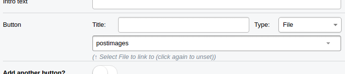
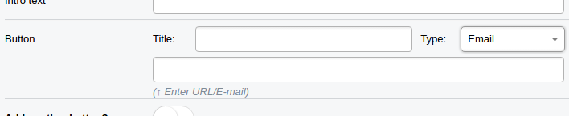

# A link field (with title) for SilverStripe

A single inline link field which allows users to set a title/name for the link, 
and select a page + optional text-anchor from the site tree, a file from 
the assets dir, an e-mail address (mailto link), or
define a custom URL to link to.

## Usage
```php
private static $db = array(
    'NextAction' => 'NamedLinkField', // A NamedLinkFormField will be scaffolded
);
```

## Requirements
* SilverStripe CMS 3.0 or greater
* Dependentdropdownfield (for in-page text-anchor selection)

## Screenshots




Pick page & text-anchor, file, e-mail or (external) URL. Fields will be auto-updated.

## TODO
* Check source-class-HtmlEditorField_Toolbar.html#_LinkForm for inline uploading of files etc
* Make translatable/i18n