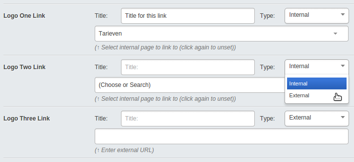

# A link field (with title) for SilverStripe

A single field which allows users to either select a page from the site tree or define a custom URL to link to, and add a title/name to the link.

## Requirements
* SilverStripe CMS 3.0 or greater

## Screenshot

Pick either internal or external, fields are auto-updated